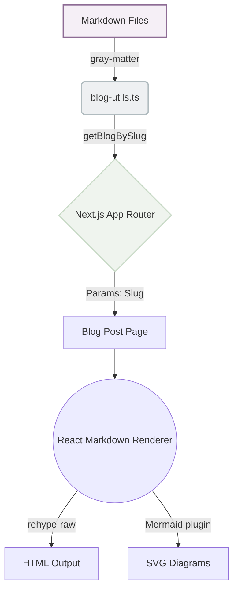

Welcome to my new digital notebook! I decided to build a custom Markdown-based blogging system so that I can directly share my engineering notes and system architectures right from my repository.

Here is a quick overview of how this blog system is architected:



## Why a custom solution?

Building it directly into `Next.js` provides several advantages:
1. **No CMS overhead:** I just commit markdown files.
2. **Version control:** Revisions are tracked alongside code.
3. **Mermaid support:** As you can see above, I can natively draw diagrams.

### Code Snippet Example

```typescript
export function getWordFrequency(blogs: BlogPost[]) {
  // calculates how often technical terms appear across all my text!
  return Object.entries(wordCount)
    .sort((a, b) => b[1] - a[1])
    .slice(0, 50);
}
```

Looking forward to writing more!
